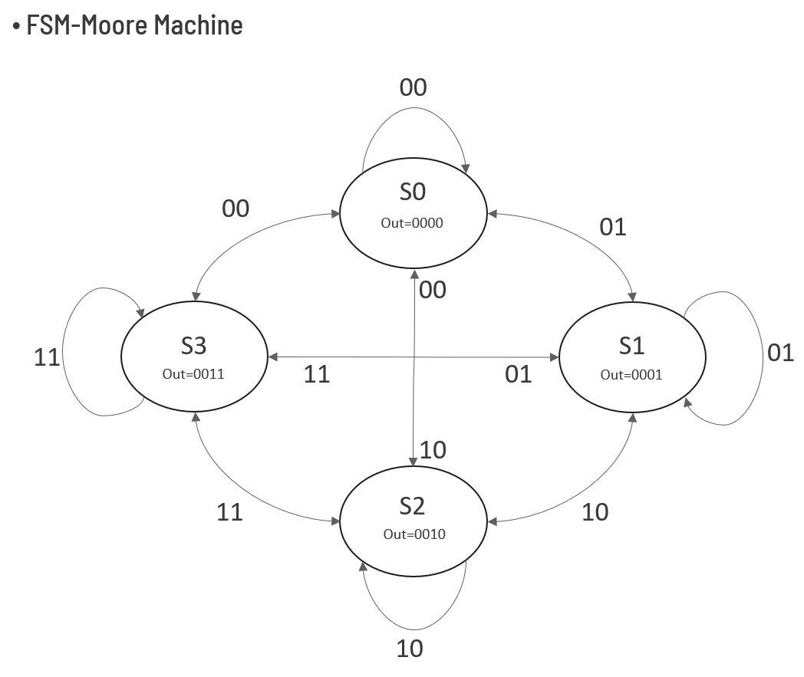
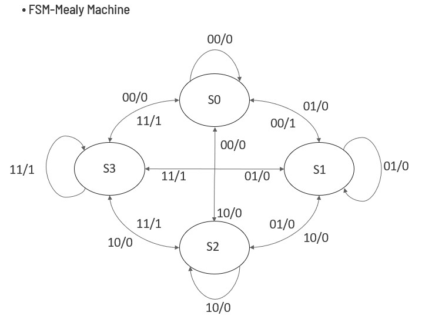

# Initial Gate and Initial project🚀  

## How to Run✨  
  
1. Use a Vivado
2. Run the testbench file for simulation
  
## Files💻  
  
- `XNOR.v`: Verilog RTL for XNOR gate  
  
- `XOR.v` : Verilog RTL for XOR gate  
  
- `MUX.v` : Verilog RTL for MUX gate  
  
- `MUX_4_1` : Verilog RTL for 4:1 MUX gate

    

***
- `FSM` : Verilog RTL for FSM

    

***
- `FSM-Moore Machine` : verilog RTL for FSM Moore

    

    Simulation result example

    | Time (ns) | Reset | Input | State     | Output |
    |-----------|-------|-------|-----------|--------|
    | 0         | 1     | 00    | XX (reset)| XX     |
    | 10        | 0     | 00    | 00 (S0)   | 0001   | 
    | 20        | 0     | 01    | 01 (S1)   | 0010   |
    | 25        | 0     | 01    | 01 (S1)   | 0010   |
    | 30        | 0     | 00    | 00 (S0)   | 0001   |
    | 40        | 0     | 10    | 10 (S2)   | 0100   |
    | 50        | 0     | 11    | 11 (S3)   | 1000   |
    | 60        | 0     | 11    | 11 (S3)   | 1000   |
    | 70        | 0     | 00    | 00 (S0)   | 0001   | 

***
- `FSM-Mealy Machine` : Verilog RTL for FSM Mealy

    

    Simulation result example

    | Time (ns) | Reset | Input (`in`) | State (`state`) | Output (`out`) | Description                                           |
    |-----------|--------|---------------|------------------|----------------|-------------------------------------------------------|
    | 0         | 1      | 00            | XX               | XX             | Reset active (initialization in progress)            |
    | 10        | 0      | 00            | 00 (S0)          | 0              | Reset released, remains in S0                        |
    | 20        | 0      | 01            | 01 (S1)          | 0              | S0 → S1, output = 0                                  |
    | 30        | 0      | 00            | 00 (S0)          | 1              | S1 → S0, output = 1 (special case in S1 with 00)     |
    | 40        | 0      | 11            | 11 (S3)          | 1              | S0 → S3, output = 1                                  |
    | 50        | 0      | 01            | 01 (S1)          | 0              | S3 → S1, output = 0                                  |
    | 60        | 0      | 00            | 00 (S0)          | 1              | S1 → S0, output = 1 (again, special case)            |
    | 70        | 0      | 10            | 10 (S2)          | 0              | S0 → S2, output = 0                                  |
    | 80        | 0      | 11            | 11 (S3)          | 1              | S2 → S3, output = 1                                  |
    | 90        | 0      | 10            | 10 (S2)          | 0              | S3 → S2, output = 0                                  |
    | 100       | 0      | 01            | 01 (S1)          | 0              | S2 → S1, output = 0                                  |
    | 110       | 0      | 00            | 00 (S0)          | 1              | S1 → S0, output = 1 (special case once more)         |

    Mealy Machine, The output depends on both the current state and the input (Mealy characteristic)

***
- `Ripple-Carry-Adder` : Verilog RTL for 16bit Ripple Carry Adder
     sourece:  https://ko.m.wikipedia.org/wiki/%ED%8C%8C%EC%9D%BC:4-bit_ripple_carry_adder.svg

    Simulation result example.

    | Time(ns) |     A     |     B     | Cin |   Sum   | Cout |
    |----------|-----------|-----------|-----|---------|------|
    |   0      | 0x0000    | 0x0000    | 0   | 0x0000  | 0    |
    |  10      | 0x0001    | 0x0001    | 0   | 0x0002  | 0    |
    |  20      | 0xAAAA    | 0x5555    | 0   | 0xFFFF  | 0    |
    |  30      | 0xFFFF    | 0x0001    | 0   | 0x0000  | 1    |
    |  40      | 0xFFFF    | 0xFFFF    | 1   | 0xFFFF  | 1    |

***
- `Adder & Subtractor` : Verilog RTL for 16bit Adder & Subtractor
     source: https://suyeon96.tistory.com/7

    Simulation result example

    | Time(ns) | M (연산) |     A     |     B     |     S (result)   | Cout |
    |----------|----------|-----------|-----------|-----------------|------|
    |   0      |    0     | 0x0005    | 0x0003    | 0x0008          | 0    |
    |  10      |    0     | 0x0064    | 0x00C8    | 0x012C (= 300)  | 0    |
    |  20      |    1     | 0x00C8    | 0x0064    | 0x0064 (= 100)  | 1    |
    |  30      |    1     | 0x0064    | 0x00C8    | 0xFF9C (= -100) | 0    |
    |  40      |    0     | 0xFFFF    | 0x0001    | 0x0000          | 1    |
    |  50      |    1     | 0x0000    | 0x0001    | 0xFFFF (= -1)   | 0    |

***
- `Half Subtractor` : Verilog RTL for 1bit half subtractor
     
    sources: https://de-iitr.vlabs.ac.in/exp/half-full-subtractor/theory.html

    Simulatio result example

    | Time(ns) |    A     |     B     |    Bout   |    D (result)  |
    |----------|----------|-----------|-----------|----------------|
    |   0      |    0     |     0     |     0     |        0       |
    |  10      |    0     |     1     |     1     |        1       |
    |  20      |    1     |     0     |     1     |        0       |
    |  30      |    1     |     1     |     0     |        0       |

    Bout stands for "Borrow Out". In a subtractor, this signal indicates whether a borrow is needed from the next higher bit.

***
- `Full subtractor` : Verilog RTL for 1bit Full subtractor
    
    sources: https://de-iitr.vlabs.ac.in/exp/half-full-subtractor/theory.html

    Simulation result example

    |  A  |  B  | Bin | Difference (D) | Borrow Out (Bout) |
    |-----|-----|-----|----------------|-------------------|
    |  0  |  0  |  0  |        0       |         0         |
    |  0  |  0  |  1  |        1       |         1         |
    |  0  |  1  |  0  |        1       |         1         |
    |  0  |  1  |  1  |        0       |         1         |
    |  1  |  0  |  0  |        1       |         0         |
    |  1  |  0  |  1  |        0       |         0         |
    |  1  |  1  |  0  |        0       |         0         |
    |  1  |  1  |  1  |        1       |         1         |

    The key difference between a Full subtractor and a Half Subtractor is that the Full Subtractor takes three inputs (A, B, and Bin), whereas the Half Subtractor only takes two inputs (A and B). The Full Subtractor can handle a borrow from a previous stage, making it suitable for multi bit subtraction.

***
